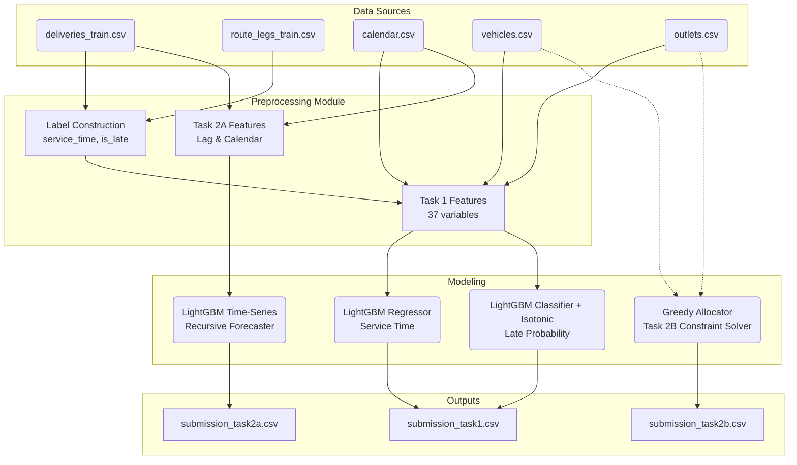
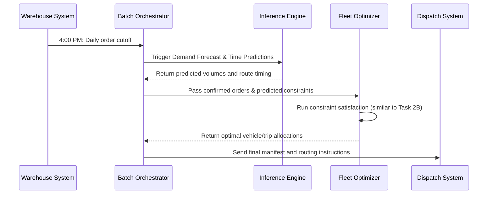

# System Architecture & Diagrams

## 1. High-Level Preprocessing & Modeling Pipeline

This diagram shows how raw CSV files are ingested, transformed into features, and fed into our models.

## 2. Proposed Deployment Approach

For real-world Waypoint Group operations, this architecture proposes a daily batch-processing workflow orchestrated by Apache Airflow or AWS Step Functions.

