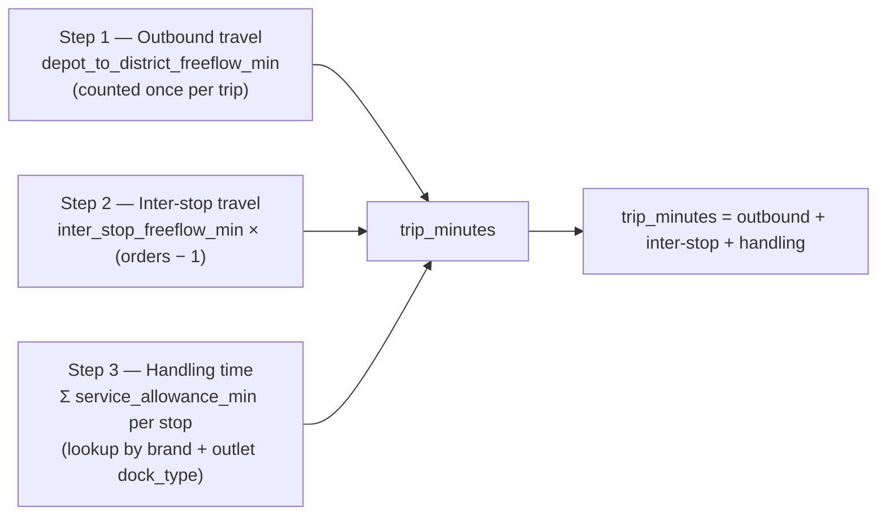
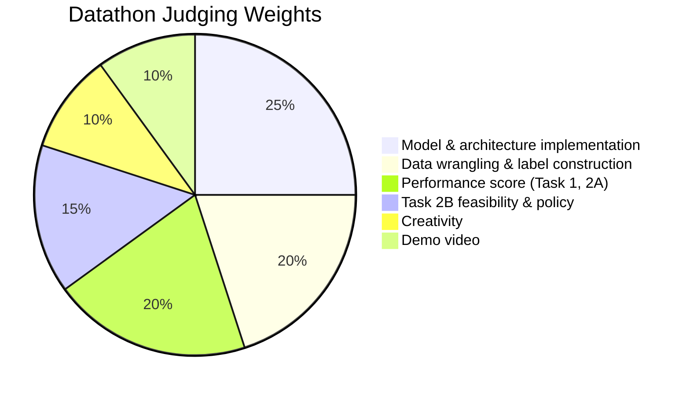
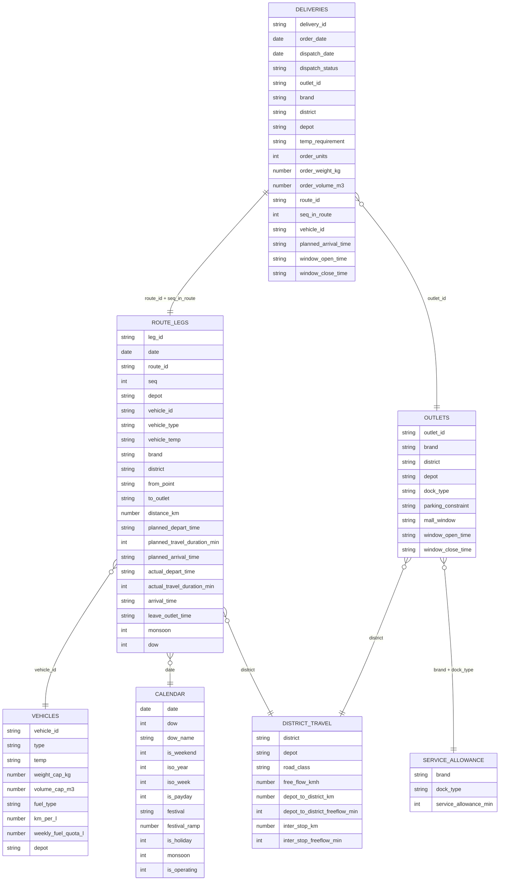

# Datathon — Tech-Triathlon 2026

**Submission due Day 15 · Friday, October 9, 2026, at 11:59 PM (Sri Lanka time)**

> Read `scenario.md` in this repo first for full business context (Waypoint Group, the four user roles, operating constraints, and shared datasets). This file covers only the Datathon-specific requirements.

---

## Overview

Waypoint needs estimates it can use before a delivery starts or demand peaks. Route records can show when a vehicle departed, how long it traveled, when it arrived, and when unloading finished. Order history can show how demand changes over time. Use the supplied synthetic records to develop predictions that support delivery planning.

> **The Datathon challenge is judged separately from the Hackathon system.** Teams are not required to integrate their Datathon solutions into their Hackathon build.

Complete the two prediction tasks and the peak-day allocation task below:
1. **Task 1** — Predict service time and lateness
2. **Task 2A** — Forecast depot demand
3. **Task 2B** — Allocate the fleet on a peak day

---

## Task 1: Predict service time and lateness

Predict two things for each planned order (`delivery_id`) in the test input:

- `pred_service_min` — predicted handling time at the outlet, in minutes.
- `pred_late_prob` — the probability it runs late, meaning it arrives after the outlet's delivery window has closed.

> **Neither target is provided as a label in the input table.** Construct the training labels from the dataset by working out the relationships from the column descriptions and document your reasoning. **Correct label construction is part of the assessment.**

Account for the following when defining your labels:
- Outlets receive goods only within their delivery window. A vehicle that arrives early waits until the window opens.
- A late arrival is still delivered in the supplied scenario. However, receiving staff may have moved to other duties, and a Fresh outlet may miss morning sales. Lateness refers to arrival **after the window closes**.
- At prediction time, planned departure, travel duration, and arrival are available for each delivery. **Actual journey and handling times are available only in the training route records.**

### Inputs
- `Test Data/task1_test_inputs.csv` — each row denotes a delivery plan for an order (`delivery_id`). Every `delivery_id` matches exactly one route leg.
- `Test Data/route_legs_test.csv` — each row denotes a single leg of the route and contains the matching route legs, including origin, distance, and planned departure and arrival times.
- Use relevant data from `Training Data/` and `General Data/`. Choose and justify your features — the challenge does not prescribe a feature set.

### Outputs
Complete `Submission Templates/submission_task1.csv`. Keep the `delivery_id` values and **row order exactly as supplied**. Do not add or remove rows. Fill only the two prediction columns.

| Column | Type | Required value |
|---|---|---|
| `delivery_id` | string | Supplied identifier. Keep unchanged. |
| `pred_service_min` | number | Predicted outlet handling time, in minutes. |
| `pred_late_prob` | number from 0 to 1 | Probability of arrival after the outlet's delivery window closes. |

**Example output**

| delivery_id | pred_service_min | pred_late_prob |
|---|---|---|
| ORD0092308 | 16.4 | 0.07 |
| ORD0092309 | 21.8 | 0.63 |

---

## Task 2A: Forecast depot demand

Waypoint needs to know the demand in advance to plan vehicle, driver, and refrigerated capacity. Forecast the **volume ordered for each depot and brand over the 10 future weeks** in the test inputs.

Predict two values for every depot, brand, and week combination:
- `pred_total_volume_m3` — total order volume for that combination, in cubic meters.
- `pred_chilled_volume_m3` — the chilled portion of that total, in cubic meters.

You only need to predict these volumes — you do **not** need to convert them into vehicle or driver requirements.

Build your training data from `deliveries_train.csv` and `task1_test_inputs.csv`. In both files, each row is one order, identified by `delivery_id`. Follow these rules when preparing the data:
- **Count every order once**, including orders that were deferred or never dispatched — they still represent demand.
- **Assign each order to the week the store requested the order.**
- Use `iso_year` and `iso_week` from `calendar.csv` so the forecast periods match the supplied calendar.
- **Only Fresh has chilled demand.** Set `pred_chilled_volume_m3` to 0 for Style and Tech.

### Inputs
- `Test Data/task2a_test_inputs.csv` — one row per depot, brand, and forecast week.
- Use `deliveries_train.csv` (Training Data), `task1_test_inputs.csv` (Test Data), and `calendar.csv` (General Data) to construct your training data and features.

### Outputs
Complete `Submission Templates/submission_task2a.csv`. Preserve the supplied `row_id` values and fill the two prediction columns.

| Column | Type | Required value |
|---|---|---|
| `row_id` | string | Supplied identifier. Keep unchanged. |
| `pred_total_volume_m3` | number | Total demand volume for the depot, brand, and week, in cubic meters. |
| `pred_chilled_volume_m3` | number | Chilled volume within that total. Use 0 for Style and Tech. |

**Example output**

| row_id | pred_total_volume_m3 | pred_chilled_volume_m3 |
|---|---|---|
| W0000 | 412.7 | 151.3 |
| W0001 | 96.4 | 0 |

---

## Task 2B: Allocate the fleet on a peak day

Plan deliveries for **one day when demand exceeds available fleet capacity**. Produce:
1. A complete allocation that marks every order as **"served" or "deferred"** and assigns every served order to a vehicle and trip.
2. A **short written policy** explaining your allocation priority and deferral decisions.

This task does **not** require a trained model. Analyze demand and available capacity, identify the limiting resources, and explain how your allocation responds. **There is no single correct allocation** — judges assess feasibility and the reasoning behind your decisions.

### Scenario S1

| Scenario | Depot | Conditions |
|---|---|---|
| S1 | Peliyagoda | A festival is one week away. Fresh demand is rising, including dairy, meat, and produce. It is not a payday, and there are no monsoon conditions. Several vehicles are in the workshop. |

Orders have closed, and the available fleet is listed in the scenario files. You **cannot** use vehicles with status `in_workshop`. Allocate only vehicles marked as available.

### Inputs
- `Test Data/task2b_peak_day_scenarios.csv` — every order, including its outlet, access restrictions, delivery window, temperature requirement, and size.
- `Test Data/task2b_peak_day_fleet.csv` — vehicles available on the scenario day and those in the workshop.
- `General Data/vehicles.csv` — vehicle capacity, temperature capability, and home depot.
- `General Data/district_travel.csv` and `General Data/service_allowance.csv` — for the trip-time calculation.

### Outputs
Complete `Submission Templates/submission_task2b.csv`. Keep `scenario`, `order_ref`, and `outlet_id` unchanged. Complete `decision`, `vehicle_id`, and `trip_id` for every row.

| Column | Type | Required value |
|---|---|---|
| `scenario` | string | Supplied identifier; always S1. |
| `order_ref` | string | Supplied order identifier. Use this as the allocation key because `outlet_id` may appear more than once. |
| `outlet_id` | string | Supplied outlet identifier, included for readability. |
| `decision` | string | "served" or "deferred" for every order. |
| `vehicle_id` | string | Assigned vehicle for a served order. Leave blank if deferred. |
| `trip_id` | 1 or 2 | Assigned trip for a served order. Leave blank if deferred. A vehicle can return to the depot and reload once, for a maximum of two trips. Orders sharing `vehicle_id` and `trip_id` form one trip and share its capacity and time limits. |

Replace every placeholder in the supplied template. For deferred orders, leave `vehicle_id` and `trip_id` blank.

**Completed example (illustrative only)**

| scenario | order_ref | outlet_id | decision | vehicle_id | trip_id |
|---|---|---|---|---|---|
| S1 | S1-000 | OUT001 | served | VEH014 | 1 |
| S1 | S1-001 | OUT001 | served | VEH002 | 2 |
| S1 | S1-002 | OUT002 | deferred | | |

### Feasibility rules

Your allocation must meet **all** rules below:

1. **Brand and district.** All orders sharing a `vehicle_id` and `trip_id` must belong to the same brand and district.
2. **Refrigeration.** Orders with `temp_requirement = chilled` require a vehicle with `temp = reefer`. Refrigerated vehicles may also carry ambient orders.
3. **Vehicle access.** Outlets with `parking_constraint = van_only` require a vehicle with `type = van`.
4. **Home depot.** A vehicle may serve only outlets assigned to its own depot.
5. **Whole orders.** Assign each served order to one vehicle and one trip. Do not split an order across trips or vehicles.
6. **Capacity.** For each trip, total `order_volume_m3` must not exceed `volume_cap_m3`, and total `order_weight_kg` must not exceed `weight_cap_kg`.
7. **Trips and time.** Each vehicle may run at most two trips in total. Its trips must fit the daily time budgets below.

### Calculate trip time

Each trip leaves the depot, travels to one district, and delivers its orders there. Calculate the outbound journey, travel between stops, and handling time. **Do not add the return journey to the depot** — the stated budgets already allow for it.

**Step 1 — Time for outbound travel:** Take `depot_to_district_freeflow_min` from the trip's district row in `district_travel.csv`. Count it once per trip.

**Step 2 — Time for travel between stops:** Multiply `inter_stop_freeflow_min` for that district by the number of orders minus one. A trip with three orders has two inter-stop journeys; a trip with one order has none.

**Step 3 — Handling time:** For each order, look up `service_allowance_min` in `service_allowance.csv` using the trip's brand and the outlet's `dock_type`. Add the allowances for all stops.

`trip_minutes = outbound travel + inter-stop travel + total handling time`

**Worked example:** A Fresh trip to Gampaha carries three orders, two with rear docks and one with street access.

| Component | Reference and calculation | Minutes |
|---|---|---|
| Depot to Gampaha | `depot_to_district_freeflow_min` = 37 | 37 |
| Travel between three stops | `inter_stop_freeflow_min` = 9; 9 × (3 − 1) | 18 |
| Handle stop 1 | Fresh + rear_dock | 15 |
| Handle stop 2 | Fresh + rear_dock | 15 |
| Handle stop 3 | Fresh + street | 16 |
| **Trip total** | 37 + 18 + 15 + 15 + 16 | **101** |

### Daily time budgets (apply to each vehicle)

| Trips | Operating window | Daily budget per vehicle |
|---|---|---|
| Fresh | 3:30 AM to 8 AM | 270 minutes |
| Style and Tech combined | Trading day | 480 minutes |

The Fresh budget applies to the total time for that vehicle's Fresh trips. The Style and Tech budget applies to the combined time for its Style and Tech trips. These are **separate windows** — a vehicle may run one Fresh trip and one Style trip, checked against their respective budgets, but may still run only **two trips in total**.

Example: a second Fresh trip to Colombo with four street-access stops takes 24 + (3 × 8) + (4 × 16) = 112 minutes. Combined with the Gampaha trip, the vehicle uses 101 + 112 = 213 of its 270 Fresh minutes. A third trip is not allowed.

### Written prioritization policy

Submit a write-up of **approximately one page or less**. Show the calculations behind your allocation and explain why you deferred specific orders. Identify what limited service on this day, and explain which deferrals were unavoidable and which were your choice, and what they cost.

---

## Rules and Regulations

- **Deadline:** The submission form closes after the deadline.
- **Model Restrictions:** You are restricted from using any pre-trained models, except for synthetic data generation or pre-processing.
- **API Usage:** Proprietary API-based modelling/preprocessing is prohibited.
- **Integrity:** Cheating, plagiarism, or rule violations will result in disqualification.
- Usage of **Low-code/No-code AI tools or fully automated end-to-end modelling tools are strictly prohibited.**

## Terms and Conditions

- **Use of Data:** The provided datasets may be used solely for the purpose of this competition. Any other use, including but not limited to commercial purposes, academic research, or personal projects, is strictly prohibited.
- **Data Sharing:** The datasets must not be shared, distributed, or transmitted in any form — whether publicly or privately — to any third party. This includes uploading the datasets to external websites, forums, or social media platforms.
- **Publication and Disclosure:** You are not permitted to publish, disclose, or make the datasets or any derivatives publicly available unless explicitly authorized by the competition organizers.
- **Data Confidentiality:** By participating in the competition, you agree to maintain the confidentiality of the datasets and any sensitive information contained within them.
- **Violation of Terms:** Any violation of these terms and conditions may result in disqualification from the competition.

---

## Deliverables

- **Architecture diagrams.** Show your models, preprocessing pipeline, and proposed deployment approach. High-level diagrams are sufficient.
- **Data preprocessing document.** A brief write-up of your data preparation, label construction, data cleaning, feature engineering, and rationale.
- **Model file(s).** Save your final model files alongside the notebook.
- **Final notebook (`TeamName_FinalNotebook.ipynb`).** Retain the cells used for label construction, preprocessing, training, and evaluation. Add a final cell that loads the saved models, demonstrates inference for Task 1 and Task 2A, and clearly prints the inputs and predictions.
- **Peak-day allocation.** Include `submission_task2b.csv` and your written prioritization policy.
- **Prediction files submissions.** Include `submission_task1.csv` and `submission_task2a.csv`, using the exact columns and identifiers in the supplied templates.
- **Demo video.** Unlisted YouTube video lasting **3–5 minutes**. Explain your model architecture, preprocessing, label construction, and the challenges you encountered.
- **AI tool disclosure.** Explain which work was AI-assisted, which was not, and how you used the tools.

---

## Judging criteria

| Criterion | Weight |
|---|---|
| Data wrangling and label construction | 20% |
| Model and architecture implementation | 25% |
| Performance score (Task 1, Task 2A) | 20% |
| Task 2B allocation feasibility and prioritization policy | 15% |
| Creativity of the solution | 10% |
| Demo video | 10% |

---

## Submission

Place all deliverables in one folder, compress it as **`TeamName_Datathon.zip`**, and upload it through the submission form.

**Submit by Friday, October 9, 2026, at 11:59 PM** Sri Lanka time (Day 15).

> Submission Form: https://forms.gle/CcPPmttWdQgHvUdi6

---

## Datathon data reference

The supplied files represent records that an operational system would collect over time.
- Clock times use **HH:MM in Asia/Colombo**. Columns ending in `_time` contain clock times.
- Durations are measured in minutes. Columns ending in `_duration_min` contain durations.

### File index

**Training files**

| File | Purpose |
|---|---|
| `deliveries_train.csv` | Each row is one order, identified by `delivery_id`. Each dispatched order is delivered as its own stop where its `route_id` and `seq_in_route` match exactly one route leg. |
| `route_legs_train.csv` | One row per route leg, from the depot or previous outlet to the next outlet. Includes planned and actual departure, travel, arrival, and completion times. Actual times appear only in these route records. |

**Test inputs**

| File | Purpose |
|---|---|
| `task1_test_inputs.csv` | Task 1 orders for a later period, with the order-record columns described below. All were dispatched. |
| `route_legs_test.csv` | Route legs associated with the Task 1 orders, containing planned rather than actual times. |
| `task2a_test_inputs.csv` | One row per depot, brand, and forecast week. |
| `task2b_peak_day_scenarios.csv` | One row per order in the peak-day scenario, with the information needed to allocate or defer it. |
| `task2b_peak_day_fleet.csv` | Vehicle availability for the peak-day scenario. |

**Reference tables**

| File | Purpose |
|---|---|
| `outlets.csv` | Outlet brand, district, depot, physical access, and delivery windows. |
| `vehicles.csv` | Vehicle type, temperature capability, capacity, fuel profile, and depot. |
| `calendar.csv` | Calendar context. |
| `district_travel.csv` | District travel distances and free-flow times. |
| `service_allowance.csv` | The dispatcher's standard handling-time allowance for each brand and dock type. |
| `traffic_speed.csv` | Typical congestion by district and hour. |
| `road_conditions.csv` | Date-specific district disruptions, such as roadworks, flooding, or incidents. |

**Submission templates**

| File | Task |
|---|---|
| `submission_task1.csv` | Service time and lateness predictions |
| `submission_task2a.csv` | Weekly depot demand forecasts |
| `submission_task2b.csv` | Peak-day allocation |

Use the exact filenames above. Keep all supplied identifiers and rows unchanged. **Task 1 also requires the original row order.** Fill the answer columns and replace any placeholders. Identifiers match your submission to the correct records — mismatched identifiers cannot be scored.

### Order record columns
`deliveries_train.csv` and `task1_test_inputs.csv` · One row per order

| Column | Format | Meaning |
|---|---|---|
| `delivery_id` | string | Unique order identifier and Task 1 prediction key. |
| `order_date` | date | The date the store's order was for. |
| `dispatch_date` | date | Date the order was dispatched. Blank if it never ran. |
| `dispatch_status` | string | `attempted`: dispatched on order_date. `deferred`: dispatched later because fleet capacity was short. `not_run`: never dispatched. |
| `outlet_id`, `brand`, `district`, `depot` | string | Outlet information. |
| `temp_requirement` | string | `chilled` requires a refrigerated vehicle; `ambient` does not. |
| `order_units` | integer | Number of items or cases. |
| `order_weight_kg` | number | Order weight in kilograms. |
| `order_volume_m3` | number | Order volume in cubic meters. |
| `route_id` | string | Route carrying the order. Blank if it never ran. |
| `seq_in_route` | integer | Route position, starting at 0. Together with `route_id` this identifies the matching leg in the route records. |
| `vehicle_id`, `vehicle_type`, `vehicle_temp` | string | Vehicle assigned to the order. |
| `planned_arrival_time` | HH:MM | Planned arrival time. |
| `window_open_time` | HH:MM | Start of the outlet's requested delivery window. |
| `window_close_time` | HH:MM | End of the outlet's requested delivery window. |

### Route leg columns
`route_legs_train.csv` and `route_legs_test.csv` · One row per route leg

| Column | Format | Meaning |
|---|---|---|
| `leg_id` | string | Unique route-leg identifier. |
| `date` | date | Date the route ran. |
| `route_id` | string | Route identifier. |
| `seq` | integer | Position on the route, starting at 0. |
| `depot`, `vehicle_id`, `vehicle_type`, `vehicle_temp`, `brand`, `district` | string | Route attributes. A route serves one depot, brand, and district. |
| `from_point` | string | `DEPOT` for the first leg; otherwise the previous outlet. |
| `to_outlet` | string | Outlet served by this leg. |
| `distance_km` | number | Road distance in kilometers. |
| `planned_depart_time` | HH:MM | Planned departure from the previous point. |
| `planned_travel_duration_min` | minutes | Planned travel duration under clear-road assumptions. |
| `planned_arrival_time` | HH:MM | Planned arrival at the outlet. |
| `actual_depart_time` | HH:MM | Training only. Actual departure from the previous point. |
| `actual_travel_duration_min` | minutes | Training only. Actual travel duration. |
| `arrival_time` | HH:MM | Training only. Actual arrival at the outlet. |
| `leave_outlet_time` | HH:MM | Training only. Time the vehicle left after completing the delivery. |
| `monsoon` | 0 or 1 | 1 for a monsoon or inter-monsoon month; otherwise 0. |
| `dow` | 0 to 6 | Day of the week, with 0 representing Monday. |

### Outlet columns
`outlets.csv`

| Column | Format | Meaning |
|---|---|---|
| `outlet_id` | string | OUT001 through OUT120. |
| `brand` | string | Fresh, Style, or Tech. |
| `district` | string | One of 12 districts. |
| `depot` | string | Peliyagoda or Kandy, according to the outlet's assigned depot. |
| `dock_type` | string | `rear_dock`: a proper loading bay. `street`: curbside unloading. `mall_bay`: shared mall bay. |
| `parking_constraint` | string | `normal`: any vehicle. `van_only`: trucks cannot access the outlet. `mall_dock`: access is limited to the mall's delivery window. |
| `mall_window` | HH:MM-HH:MM | Fixed mall delivery window. Blank for outlets outside malls. |
| `window_open_time` | HH:MM | Start of the requested delivery window. |
| `window_close_time` | HH:MM | End of the requested delivery window. |

### Vehicle columns
`vehicles.csv`

| Column | Format | Meaning |
|---|---|---|
| `vehicle_id` | string | VEH001 through VEH060. |
| `type` | string | `truck` or `van`. Only vans may serve `van_only` outlets. |
| `temp` | string | `reefer`: refrigerated and able to carry chilled or ambient goods. `ambient`: cannot carry chilled goods. |
| `weight_cap_kg` | number | Maximum weight per trip, in kilograms. |
| `volume_cap_m3` | number | Maximum volume per trip, in cubic meters. |
| `fuel_type`, `km_per_l`, `weekly_fuel_quota_l` | string, number, number | Fuel type, kilometers per liter, and weekly fuel quota in liters. |
| `depot` | string | Home depot. The vehicle serves only that depot's outlets. |

### Calendar columns
`calendar.csv`

| Column | Format | Meaning |
|---|---|---|
| `date` | date | One row per calendar date. |
| `dow`, `dow_name`, `is_weekend` | 0 to 6, string, 0 or 1 | Day number, day name, and weekend flag. 0 represents Monday in `dow`. |
| `iso_year`, `iso_week` | integer | ISO year and week used to group demand. |
| `is_payday` | 0 or 1 | 1 on payday. |
| `festival` | string | Festival name on the festival date; otherwise blank. |
| `festival_ramp` | 0 to 1 | Proximity to a festival, rising over the preceding nine days. 0 away from the festival; 1 on the festival date. |
| `is_holiday` | 0 or 1 | 1 on a festival date or public holiday; otherwise 0. |
| `monsoon` | 0 or 1 | 1 in a monsoon or inter-monsoon month; otherwise 0. |
| `is_operating` | 0 or 1 | 1 when deliveries operate on that date; otherwise 0. |

### District travel columns
`district_travel.csv`

| Column | Format | Meaning |
|---|---|---|
| `district`, `depot` | string | District and its serving depot. |
| `road_class` | string | `urban`, `suburban`, `highway`, or `hill`. |
| `free_flow_kmh` | km/h | Clear-road speed assumed in the plan. |
| `depot_to_district_km` | km | Distance from the depot to the district. |
| `depot_to_district_freeflow_min` | minutes | Clear-road travel time from the depot to the district. |
| `inter_stop_km` | km | Typical distance between outlets within the district. |
| `inter_stop_freeflow_min` | minutes | Typical clear-road travel time between outlets within the district. |

### Service allowance columns
`service_allowance.csv` · One row per brand and dock type

| Column | Format | Meaning |
|---|---|---|
| `brand`, `dock_type` | string | One row per brand-and-dock-type combination. |
| `service_allowance_min` | minutes | Handling time budgeted per stop. This is a planning allowance, not an observed duration. |

### Traffic speed columns
`traffic_speed.csv` · Documented key columns

| Column | Format | Meaning |
|---|---|---|
| `monsoon` | 0 or 1 | 1 in a monsoon or inter-monsoon month; otherwise 0. |
| `speed_index` | number | Speed relative to clear roads. 100 means free-flowing traffic; lower values mean slower travel. |

### Road condition columns
`road_conditions.csv` · Documented key columns

| Column | Format | Meaning |
|---|---|---|
| `disruption_index` | number | Date-specific disruption in a district. 100 means clear conditions; lower values indicate disruption such as roadworks, flooding, or an incident. |

### Peak day order columns
`task2b_peak_day_scenarios.csv`

| Column | Format | Meaning |
|---|---|---|
| `scenario` | string | Always S1. |
| `order_ref` | string | Unique order identifier within the scenario. Use this as the allocation key. |
| `outlet_id`, `brand`, `district`, `depot` | string | Outlet and network identifiers for the order. |
| `dock_type`, `parking_constraint`, `mall_window`, `window_open_time`, `window_close_time` | string | Outlet access and delivery-window information copied into the scenario file. |
| `temp_requirement` | string | `chilled` or `ambient`. |
| `order_units`, `order_weight_kg`, `order_volume_m3` | number | Order size in units, kilograms, and cubic meters. |
| `deferred_yesterday` | 0 or 1 | 1 if the outlet was skipped on the previous run. |
| `days_since_last_served` | integer | Days since the outlet last received a delivery. |

### Peak day fleet columns
`task2b_peak_day_fleet.csv`

| Column | Format | Meaning |
|---|---|---|
| `scenario` | string | Always S1. |
| `vehicle_id`, `status` | string | Vehicle identifier and availability. Available vehicles can be allocated; `in_workshop` vehicles cannot. |

### Validation scripts

`check_allocation.py` checks the Task 2B allocation against the feasibility rules and can be run before you submit. Passing these checks confirms that your allocation **meets the feasibility rules**, not that it is optimal. Judges assess how you prioritized orders and explain your deferrals.
