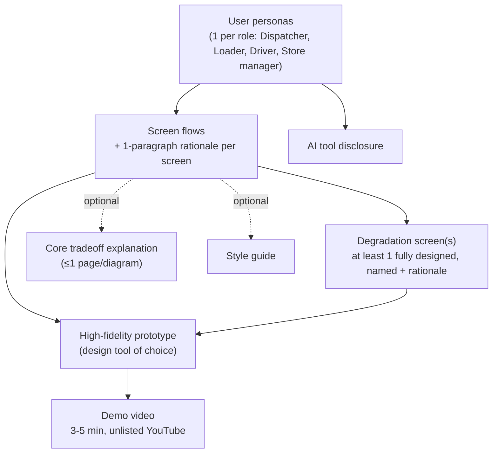
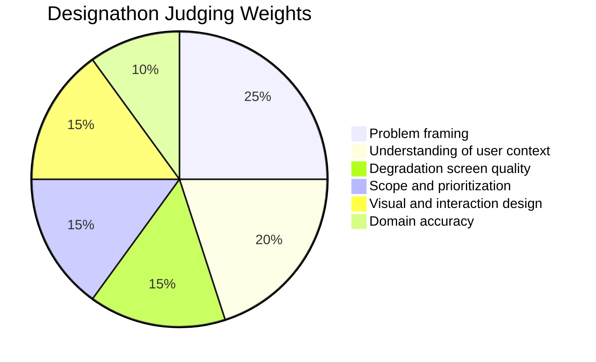

# Designathon — Tech-Triathlon 2026

**Submission due Day 5 · Tuesday, September 29, 2026, at 11:59 PM (Sri Lanka time)**

> Read `scenario.md` in this repo first for full business context (Waypoint Group, the four user roles, operating constraints, and shared datasets). This file covers only the Designathon-specific requirements.

---

## What you're building

Design **one system** that helps **all four roles** complete the delivery workflow (Dispatcher, Loader, Driver, Store manager — see `scenario.md`). Show how you understand the operation, which problems you prioritize, and why your scope is appropriate.

**Connect the role-specific experiences.** A dispatcher's decision should reach the loader, and a driver's delivery record should give the store manager information they can act on.

---

## Scope

Design the screens each role needs to complete its work, including **at least one fully developed screen for a failure scenario**. Explain your choices. Judges will assess **prioritization and restraint**, as well as the quality of the experience.

> Restraint is itself a judged criterion — this is not a "design every possible screen" exercise.

---

## Failure scenarios (degradation screens)

Design at least one screen for a situation in which the normal workflow breaks down. This is called a **degradation screen** in the judging criteria.

- Choose the scenario, name it, and explain in a short paragraph **why it matters to Waypoint**.
- You may include more than one, but **response quality matters more than the number of scenarios**.

---

## Deliverables

- **User personas.** One persona for each of the four roles, grounded in the working conditions and needs described in `scenario.md`.
- **Screen flows.** Show each role's screens and include a **one-paragraph rationale for every screen**, explaining its purpose and priorities.
- **Degradation screens.** At least one fully designed failure scenario, with its name and rationale.
- **High-fidelity prototype.** Use a design tool of your choice to demonstrate the flows you designed.
- **Demo video.** Upload a **3–5 minute** demo video on YouTube as an **unlisted** video. Walk through your design workflow and discuss any assumptions that influenced your design for the given scenario. Submit the YouTube URL to the submission form.
- **AI tool disclosure.** Explain which work was AI-assisted, which was not, and how you used the tools.
- **Core tradeoff explanation (optional).** Up to one page or one diagram explaining your main design tradeoff.
- **Style guide (optional).**

---

## Judging criteria

| Criterion | Weight |
|---|---|
| Problem framing | 25% |
| Understanding of user context | 20% |
| Degradation screen quality | 15% |
| Domain accuracy | 10% |
| Scope and prioritization | 15% |
| Visual and interaction design, including consistency across roles | 15% |

---

## Submission

Organize your personas, screen flows, rationale, degradation screens, diagrams, AI tool disclosure, core tradeoff explanation (optional), and style guide (optional) into **one design file with distinct pages**.

- Export the file using **`TeamName_Designathon`** as the base filename.
- Compress it as **`TeamName_Designathon.zip`** and upload it through the submission form.
- Upload shareable links to your **prototype** and **demo video** onto the submission form as well.

**Submit by Tuesday, September 29, 2026, at 11:59 PM** Sri Lanka time (Day 5). Judges assess the design submitted at that deadline. You may refine the solution during the Hackathon, but **document significant departures from the submitted design in your README**.

> Submission Form: https://forms.gle/H6dqUZP6pXdGC8Go8

---

## Rules & restrictions (from kick-off session)

1. Your design is judged **exactly as submitted on Day 5**.
2. You may keep developing the solution in the Hackathon — but document any significant departures in your README.
3. AI tools are allowed — **say so**. Your disclosure should state plainly what was AI-assisted, what was not, and how AI was used.
