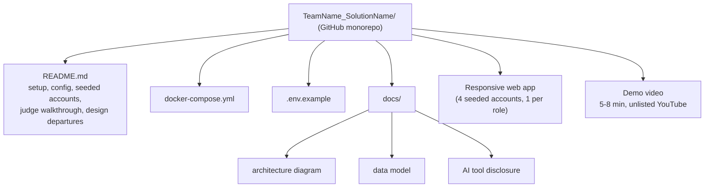
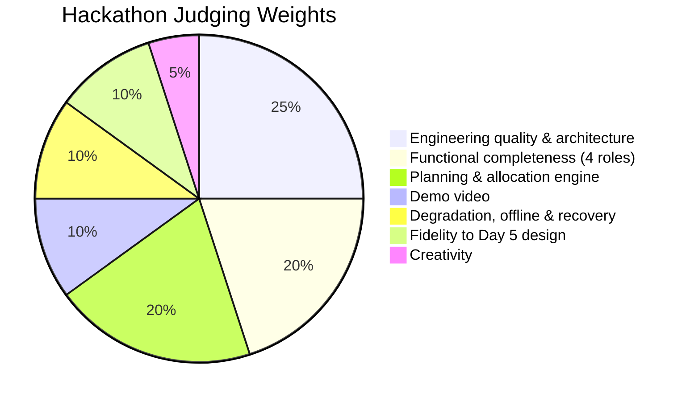

# Hackathon — Tech-Triathlon 2026

**Submission due Day 10 · Sunday, October 4, 2026, at 11:59 PM (Sri Lanka time)**

> Read `scenario.md` in this repo first for full business context (Waypoint Group, the four user roles, operating constraints, and shared datasets). This file covers only the Hackathon-specific requirements.

---

## What you're building

Build the flows, screens, and capabilities in your **Designathon submission**. That design is your **implementation specification**, and judges will assess how faithfully you deliver it.

### Every submission must meet these requirements

- **Provide a responsive web application** that lets a judge complete the delivery workflow across **all four roles**, from planning through loading and delivery to receipt at the outlet. Judges will assess the **driver and loader experiences on phone-sized screens**. Native applications are optional additions to the required web application.
- **Make the system respect the operating constraints.** Plans must account for capacity, temperature requirements, outlet access, delivery windows, and fuel quotas. (Full constraint list is in `scenario.md`.)

---

## Planning and allocation

Your system must **assign orders to vehicles and trips** and handle a day when demand exceeds available capacity. You may use automatic allocation, assisted planning, or manual decisions with validation — whatever approach you choose, the system must produce an allocation that **respects the operating constraints and identifies deferred orders**.

---

## Judge walkthrough

Add a **numbered walkthrough** to your README that a judge can follow across all four roles, from planning to completed delivery. Seed the system with the shared datasets and **at least one realistic delivery day** so the walkthrough works on a fresh installation.

```mermaid
sequenceDiagram
    actor S as Store Manager
    actor D as Dispatcher
    actor L as Loader
    actor Dr as Driver

    S->>D: Place order (before 4 PM cutoff)
    D->>D: Close orders into one queue
    D->>D: Plan & allocate (vehicles, trips, deferrals)
    D->>L: Stop sequence + vehicle assignment
    L->>L: Load per sequence; flag shortfalls
    L->>Dr: Vehicle loaded, ready to depart
    Dr->>Dr: Deliver; record outcomes (works offline)
    Dr->>S: Arrive & deliver goods
    S->>S: Confirm receipt / report issues
    D->>D: Use demand forecasts for future capacity
```

---

## Deliverables

- **Deployed system.** A public URL and credentials for **four seeded accounts, one per user role**.
- **Source repository.** GitHub monorepo named **`TeamName_SolutionName`**. It must contain:
  - A **README** with setup and configuration instructions, seeded account details, the judge walkthrough, and significant departures from the Designathon submission.
  - A **Docker Compose file** and an **`.env.example`** file at the repository root. `docker compose up` must start the complete stack, including the database and seed data.
  - A **`docs/`** folder at the repository root containing an **architecture diagram** and **data model**, showing the main components and how the system stores and connects its data.
  - An **AI tool disclosure** in the same `docs/` folder, explaining which work was AI-assisted, which was not, and how you used the tools.
- **Demo video.** Unlisted YouTube video lasting **5–8 minutes**. Show all four roles completing the walkthrough, followed by a brief explanation of the code and architecture.



---

## Judging criteria

| Criterion | Weight |
|---|---|
| Functional completeness across all four roles | 20% |
| Planning and allocation engine | 20% |
| Degradation, offline operation, and recovery | 10% |
| Fidelity to the Day 5 design | 10% |
| Engineering quality and architecture | 25% |
| Creativity | 5% |
| Demo video | 10% |



---

## Submission

Submit the **repository link, deployed URL, seeded account credentials, and demo video link** through the submission form.

**Submit by Sunday, October 4, 2026, at 11:59 PM** Sri Lanka time (Day 10). **Code pushed after the deadline will not be considered.** Keep the deployment live throughout the review period and, if your team advances, through the semifinal and Grand Finale periods.

> Submission Form: https://forms.gle/WurHAKjbq2XEZQhbA

---

## Ground rules (from kick-off session)

1. **Build your design.** Your Day-5 design is the specification; fidelity to it is scored.
2. **Operable end to end.** A judge must be able to run one complete cycle through your system, touching every user role you designed for.
3. **Responsive web app.** The web version is mandatory and is assessed on a phone-sized screen for mobile users. Native apps are an optional extra only.
4. Plans must be **runnable** — respect every operating constraint in the booklet. Departed from your design? Document it in the README.
5. AI tools may be used freely, but you must **understand, explain, and own every line you submit**.
