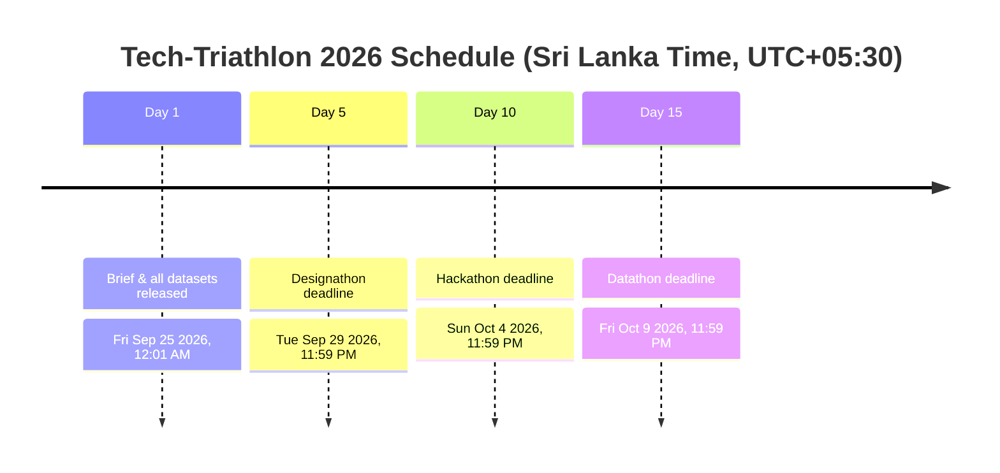
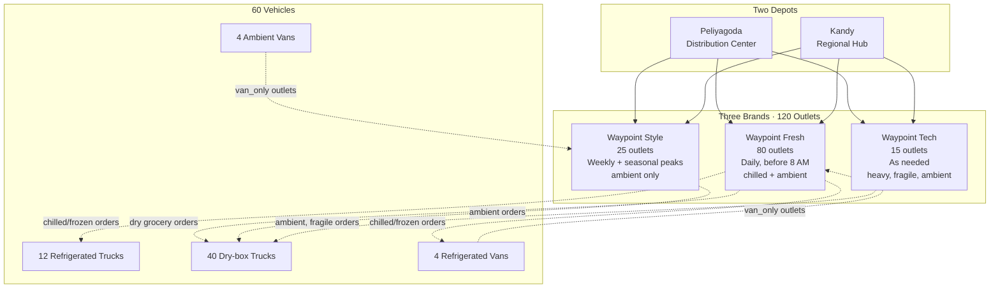
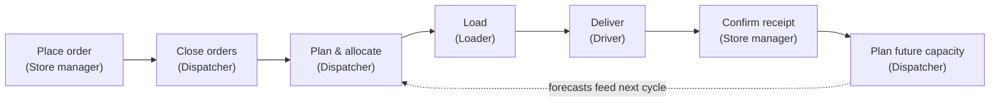

# Tech-Triathlon 2026 — Scenario Brief

**Theme: "The Intelligent Enterprise"**
A competition by Rootcode.

> Design and build a delivery planning system for Waypoint Group, then develop the predictions that help its team plan ahead.

This file is the **shared context** for all three phases (Designathon, Hackathon, Datathon). It is identical across all three phase repos. Read this first, then read the phase-specific file (`designathon.md`, `hackathon.md`, or `datathon.md`) in this repo.

All information below is transcribed from the official *Challenge Booklet · Tech-Triathlon 2026*. All competition data is synthetic and does not represent a real company, outlet, or person.

---

## How the competition works

Tech-Triathlon 2026 follows **one business challenge across three phases over 15 days**. The brief and all datasets are released together on Day 1 — there are no separate challenge releases. All dates and times use **Sri Lanka time (Asia/Colombo, UTC+05:30)**.

| Milestone | Day | Date and time in Sri Lanka |
|---|---|---|
| Brief and all datasets released | 1 | Friday, September 25, 2026, at 12:01 AM |
| **Designathon deadline** | 5 | **Tuesday, September 29, 2026, at 11:59 PM** |
| **Hackathon deadline** | 10 | **Sunday, October 4, 2026, at 11:59 PM** |
| **Datathon deadline** | 15 | **Friday, October 9, 2026, at 11:59 PM** |

**Key rules:**
- Your **Hackathon build must follow your Designathon submission** — judges assess continuity between the two.
- If you miss a phase, you may continue to the next phase, but you receive **zero** for the missed phase.
- **All three phases contribute equally** to your overall score.

---

## Waypoint Group

Waypoint Group (Pvt) Ltd is a **fictional** Sri Lankan retail group with three brands sharing one distribution network.

| Brand | Outlets | Goods | Delivery schedule |
|---|---|---|---|
| Waypoint Fresh | 80 | Groceries, chilled and frozen goods; a wide range of products | Daily; before stores open at 8 AM |
| Waypoint Style | 25 | Hanging garments and cartons | Weekly, with seasonal peaks |
| Waypoint Tech | 15 | Appliances and consumer electronics | As needed; high-value, fragile goods |

- The network serves **120 outlets** through a **distribution center in Peliyagoda** and a **regional hub in Kandy**.
- The fleet has **60 vehicles**: 12 refrigerated trucks, 40 dry-box trucks, and 8 small vans for outlets larger vehicles cannot reach.
- **4 of the 8 vans are refrigerated**, giving the fleet **16 vehicles total** that can carry chilled goods.
- Each vehicle operates from its **assigned depot**.

---

## The business problem

Waypoint's three brands compete for the same delivery capacity. Fresh needs deliveries to reach its 80 supermarkets before they open at 8 AM. Chilled orders require refrigerated vehicles, and some outlets can only be reached by van. Style's garments fill a vehicle's available volume before reaching its weight limit, and around half of its stores are in malls with fixed delivery windows. Tech's appliances are heavy, fragile, and valuable, with demand that varies from day to day.

On most days, the fleet cannot meet every brand's needs at once. Dispatchers must allocate capacity while accounting for outlet access, delivery windows, and weekly fuel quotas. When demand exceeds capacity, they must decide which orders to defer and explain the consequences.

### How orders reach the dispatcher

Store managers place orders according to their brand's delivery schedule. Fresh outlets order dry groceries for every operating day they trade and place separate chilled orders on several days each week. A Fresh outlet can therefore have **two orders for the same delivery day**. Style orders weekly for a scheduled delivery day, with larger orders ahead of seasonal peaks. Tech orders as needed, often for a single large item.

**Orders for the next day close at 4 PM.** After the cutoff, the dispatcher plans against the confirmed orders, available vehicles, and operating constraints. Orders received after the cutoff wait for the following run.

### How Waypoint works today

Dispatchers plan deliveries using spreadsheets and their network knowledge. They communicate instructions through phone calls, conversations at the loading dock, and printed run sheets. Once vehicles leave, dispatchers have no shared view of progress. Drivers report problems by phone, and changes reach each person through separate calls. Handwritten notes provide only a limited record of deliveries and deferral decisions.

### Problems your solution must address

- **Planning is fragmented.** Orders arrive by phone or message and are entered again in a spreadsheet. The plan depends on one dispatcher's knowledge.
- **Delivery progress is difficult to track.** Dispatchers usually learn about a problem only after a driver has reached the outlet.
- **Deferrals lack a clear record.** Decisions made under pressure can leave the same outlet unserved on consecutive runs.
- **Communication does not support feedback.** Printed run sheets and verbal instructions provide no reliable way to record proof of delivery or flag a loading shortfall before departure.
- **Demand is difficult to anticipate.** Waypoint cannot estimate the vehicles, drivers, or refrigerated capacity it will need ahead of paydays and festivals.
- **Service time and lateness are not predicted.** Dispatchers discover delays after they have affected a delivery.
- **Field connectivity is unreliable.** The solution must support work without a connection and reconcile records when connectivity returns.

---

## Operating constraints

### Vehicles
- Every vehicle has a weight limit and a volume limit. A load must satisfy both.
- Only refrigerated vehicles may carry chilled or frozen goods. Refrigerated vehicles may also carry ambient goods. Ambient vehicles cannot carry chilled or frozen goods.
- Each vehicle has a weekly fuel quota. Route distance consumes that allowance.
- A vehicle can run up to **two routes per day**. Waypoint operates **Monday through Saturday**.
- Each vehicle has a driver. Driver availability is not a separate constraint when allocating the existing fleet.

### Outlets
- Every outlet has a delivery window. Fresh deliveries must arrive before stores open at 8 AM, although individual outlets' windows may differ.
- Mall outlets accept deliveries only within the mall's fixed access window.
- Outlets marked `van_only` cannot be served by trucks.
- Unloading conditions vary by outlet. Goods may arrive through a rear dock, at the curb, or through a shared mall loading bay.

### Demand and operating days
Paydays, festivals, weekends, and monsoon conditions affect demand or travel time. Use `calendar.csv` to identify operating dates.

When demand exceeds capacity, the dispatcher must decide which orders move to the next run and record the reason.

### Connectivity
Mobile coverage can drop across hill country, the Kandy corridor, and rural districts.

Work away from the depot must remain usable **offline**. Records must reconcile when the connection returns.

---

## The four user roles

Design/build the system around the conditions each person works in and the information they need from other roles.

### Dispatcher
Works at a large screen in the Peliyagoda planning office with stable connectivity. Builds the daily plan using a spreadsheet and knowledge of outlet restrictions and vehicle capabilities.
- Needs visibility into delivery progress and problems after vehicles leave the depot.
- Needs to explain deferral decisions and identify outlets that have already been skipped.

### Loader
Works at the Peliyagoda or Kandy warehouse dock using a shared tablet or terminal. Printed loading lists can become outdated when plans change.
- Needs the stop sequence so goods can be loaded in an order that supports unloading.
- Needs to flag missing or damaged items before a vehicle leaves.

### Driver
Works on the road using a personal phone. Currently relies on a paper run sheet and phone calls for changes. Design interactions for use when safely stopped.
- Needs to record delivery outcomes and proof of delivery so disputes do not depend on memory.
- Needs to record work offline when coverage drops and synchronize it when connectivity returns.

### Store manager
Works at the outlet counter using a desktop or phone. Places orders by phone or message without confirmation that they received or scheduled them.
- Needs an expected arrival time to schedule staff to receive goods.
- Needs clear notice when an order is deferred, plus a way to confirm receipt and report issues.

---

## Your objective

Build a system that connects **ordering, planning, loading, delivery, and receipt** across these four roles. Help Waypoint make delivery decisions it can explain and plan capacity ahead of demand. The **Designathon** defines the experience, and the **Hackathon** implements it. The **Datathon** develops estimates of outlet service time, arrival lateness, and future demand volume to support planning.

| Stage | Role | System requirement |
|---|---|---|
| Place order | Store manager | Capture and confirm the order before the cutoff. |
| Close orders | Dispatcher | Bring confirmed orders into one queue. |
| Plan and allocate | Dispatcher | Assign served orders to vehicles and trips; identify deferred orders. |
| Load | Loader | Load for the planned stop sequence and flag shortfalls. |
| Deliver | Driver | Follow the route and record each stop, including while offline. |
| Confirm receipt | Store manager | Confirm what arrived and report issues. |
| Plan future capacity | Dispatcher | Use demand forecasts to plan vehicles, drivers, and refrigerated capacity. |

*Service-time and lateness predictions (Datathon Task 1) support the Deliver stage. Demand forecasts (Datathon Task 2A) support the Plan future capacity stage.*

---

## Shared datasets

All three phases use the same **120 outlets, 60 vehicles, two depots, and calendar**. Use these records consistently across your designs, working system, and models.

| File | Purpose |
|---|---|
| `outlets.csv` | The 120 outlets, including brand, district, depot, access restrictions, and delivery windows. |
| `vehicles.csv` | The 60 vehicles, including type, temperature capability, weight and volume limits, fuel profile, and home depot. |
| `calendar.csv` | Dates across the history and forecast horizon, with payday, festival, monsoon, and operating-day information. |

Additional Datathon-only files and their key columns are documented in `datathon.md`.

**Dataset access:** via the link provided in the original Challenge Booklet ("Click Here to Access the Datasets").

---

## Competition-wide rules (from kick-off session)

- One business challenge runs across all three phases; brief and datasets released together on Day 1.
- Every submission must be **original work** that has not been published or exhibited before.
- Each deadline is final. Missing a phase means zero points for that phase, but you may continue in later phases.
- Designathon, Hackathon, and Datathon **contribute equally** to your final score.
- You may use any programming languages, frameworks, IDEs, and AI tools **of your choice, but they must be disclosed**.
- All dates and times follow **Sri Lanka Standard Time (UTC+05:30)**.
