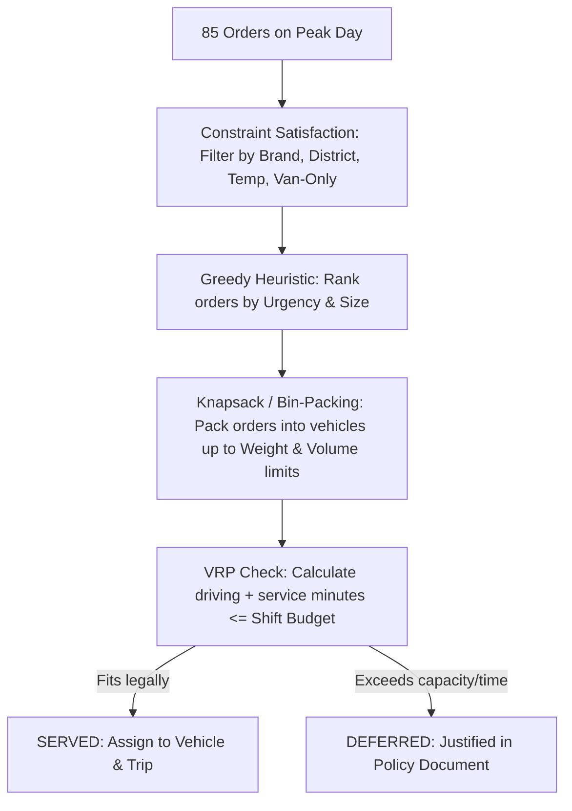

# Chat History: Project Briefing & Machine Learning Foundations

This document records the full discussion from this session, covering the Datathon project briefing, beginner-friendly task breakdowns, and explanations of essential machine learning and forecasting concepts.

---

## 1. Project Briefing

### User Query
> *Assume I have no idea about this project. brief me*

### Assistant Response

# Project Briefing: Tech Triathlon 2026 — Datathon

**Team:** BigBug  
**Deadline:** Friday, October 9, 2026, at 11:59 PM Sri Lanka Time (UTC+05:30)  
**Main Reference:** AGENTS.md | Project Overview (`docs/specs/project-overview.md`)

---

### 1. What Is This Project?

This repository contains the solution for the **Datathon Phase** of **Tech Triathlon 2026** (organized by Rootcode).

#### The Business Context: Waypoint Group
**Waypoint Group (Pvt) Ltd** is a fictional Sri Lankan retail conglomerate operating three retail brands through a shared supply chain:
- **DailyFresh:** Fast-moving groceries and perishables requiring strict early-morning delivery and cold-chain support.
- **UrbanMart:** General supermarket goods, dry foods, and household items.
- **Homeware Direct:** Non-perishable home goods and bulky items.

#### The Physical Network
- **2 Depots:**
  - **Depot West (Kelaniya):** Supplies Western, Central, and Southern coastal corridors.
  - **Depot Central (Ambewela):** Handles highland and interior regional supplies.
- **120 Outlets** spread across Sri Lanka with varying access limitations (some located in congested alleys that strictly permit *vans only*).
- **60 Vehicles** (mix of ambient trucks, refrigerated trucks, ambient vans, and refrigerated vans).

---

### 2. The Three Core Tasks

The competition poses three distinct data science and optimization challenges:

| Task | Type | Business Goal | Required Output |
| :--- | :--- | :--- | :--- |
| **Task 1** | **Supervised ML** (Regression & Classification) | Predict operational service duration (unloading/handling time at outlet) and the probability of missing the agreed delivery window. | `pred_service_min`<br>`pred_late_prob` |
| **Task 2A** | **Time-Series Forecasting** | Forecast depot-level demand 10 weeks into the future for both total volume (m³) and chilled volume (m³) to assist capacity planning. | `pred_total_volume_m3`<br>`pred_chilled_volume_m3` |
| **Task 2B** | **Constraint Optimization** | Allocate orders to available vehicles and multi-drop trips during a high-stress peak festival day, deferring orders when capacity or shift limits are reached. | `decision` (`served`/`deferred`)<br>`vehicle_id`, `trip_id` |

---

### 3. Key Operational Rules & Constraints (Task 2B Focus)

Submissions for Task 2B must pass automated verification via `check_allocation.py`:
1. **Fleet Availability:** Vehicles currently undergoing maintenance/workshop cannot be scheduled.
2. **Depot Match:** A vehicle can only operate out of its assigned home depot.
3. **Trip Homogeneity:** A single trip can serve **only one brand** and **one district** (no cross-brand or multi-district co-loading).
4. **Physical & Cold Chain Capabilities:**
   - Chilled goods require a refrigerated (`reefer`) vehicle.
   - Outlets marked `van_only` cannot receive trucks.
   - Combined order weight (kg) and volume (m³) must strictly stay within vehicle payload limits.
5. **Time & Shift Limits:**
   - Maximum **2 trips per vehicle per day**.
   - Early morning / Fresh trips: ≤ 270 minutes (03:30 – 08:00 window).
   - Daytime trips: ≤ 480 minutes (standard 8-hour shift).

---

### 4. Current State of the Codebase

```text
├── data/raw/                  # Raw competition tables (outlets, deliveries, routes, speed, travel)
├── notebooks/
│   ├── 01_eda.ipynb           # Exploratory data analysis & feature exploration
│   ├── 02_task1_modeling.ipynb # Task 1 model training & validation
│   └── 03_task2a_modeling.ipynb# Task 2A forecasting models
├── src/                       # Reusable modules (preprocessing, features, Task 2B allocator)
├── BigBug_FinalNotebook.ipynb # Consolidated submission notebook with inference cells
├── check_allocation.py        # Official constraint validation script
├── docs/                      # Written submission deliverables
│   ├── data_preprocessing.md
│   ├── architecture_diagrams.md
│   ├── task2b_prioritization_policy.md
│   ├── ai_tool_disclosure.md
│   └── demo_video_script.md
└── BigBug_Datathon.zip        # Pre-packaged submission archive
```

---

### 5. Judging Criteria & Submission Rules

| Criterion | Weight | Key Rule to Remember |
| :--- | :---: | :--- |
| **Model & Architecture** | 25% | **No pretrained models** or external proprietary prediction APIs (e.g. GPT API). Models must train locally on provided data. |
| **Data Wrangling & Labels** | 20% | Correct join keys and target label construction. |
| **Performance (1 & 2A)** | 20% | Metric scores on the unseen test set. |
| **Task 2B Feasibility** | 15% | Zero constraint violations (`FEASIBILITY: PASSED`). |
| **Creativity** | 10% | Sound methodology, feature engineering, and edge-case handling. |
| **Demo Video** | 10% | 3–5 min unlisted YouTube walkthrough video. |

---

## 2. Beginner Breakdown of the Tasks & Theoretical Foundations

### User Query
> *I want to understand what we did so far? I only knows very basics of machine learning. I still do not understand 3 tasks. can you explain the tasks like you explain to a beginner and what are the theories & concepts I need to learn in order to understand each task and implementation.*

### Assistant Response

### The High-Level Story

Imagine a large retail company in Sri Lanka (**Waypoint Group**) that runs supermarkets and retail stores across the country:
* **2 central warehouses (depots):** Where all inventory is stored.
* **120 retail outlets:** Stores that order goods daily or weekly.
* **60 delivery trucks/vans:** Vehicles of different sizes and types (some have refrigerators, some don’t).

The challenge is divided into **three realistic operational problems**:
1. **At the store level:** Predicting how long deliveries take and if the driver will be late (**Task 1**).
2. **At the warehouse level:** Predicting how much stock the warehouses will need over the next 10 weeks (**Task 2A**).
3. **On a crisis / peak day:** Solving a massive logistical puzzle when orders spike, some trucks break down, and you can’t deliver everything (**Task 2B**).

---

### Task 1: Service Time & Lateness Prediction

#### 1. Intuition
* **The Situation:** A truck arrives at an outlet. How long will the driver spend unloading goods, signing papers, and clearing the loading dock? That's **Service Time** (in minutes).
* **The Second Problem:** Each store gives a delivery window (e.g., "Arrive between 9:00 AM and 10:30 AM"). What is the chance (e.g., 15% vs 85%) that traffic or delays cause the truck to arrive **after 10:30 AM**? That's **Late Probability**.

#### 2. What We Implemented
We trained **two separate models**:
1. A **Regression Model** (`pred_service_min`): Takes inputs like `order_weight`, `order_volume`, `dock_type`, and `number_of_items` and outputs a continuous number (e.g., 28.4 minutes).
2. A **Classification Model** (`pred_late_prob`): Takes inputs like `distance_from_depot`, `scheduled_arrival`, `rush_hour_traffic`, and `slack_time` and outputs a calibrated probability between 0.0 and 1.0.

#### 3. Theory & Concepts You Need to Learn
* **Supervised Learning:** Training a model on historical inputs (X) and known answers (y).
* **Regression vs. Classification:** Regression outputs a continuous number; classification outputs a category or probability.
* **Decision Trees & Ensembles:** Splitting data with if-else questions; ensembling joins multiple trees.
* **Gradient Boosting (LightGBM):** Sequentially training trees where each new tree corrects earlier errors.
* **Evaluation Metrics (RMSE, MAE, Log Loss, ROC-AUC):** Measuring deviation in minutes and calibration of risk scores.
* **Probability Calibration (Isotonic Regression):** Adjusting model outputs so a 70% prediction genuinely translates to a 70% real-world event rate.

---

### Task 2A: Depot Demand Forecasting

#### 1. Intuition
* **The Situation:** Warehouses cannot magically summon inventory overnight. The supply chain manager needs to know 10 weeks in advance: *"How many cubic meters (m³) of total goods, and specifically chilled milk/meat, will Kelaniya and Ambewela depots ship out each week?"*
* Under-predicting leads to stockouts; over-predicting wastes warehouse space and spoils perishables.

#### 2. What We Implemented
* Aggregated historical daily orders into **weekly totals** per depot and per brand.
* Engineered **time-series features** (past week volumes, 4-week averages, holiday flags).
* Built a **Recursive Forecasting Loop**: Predict Week 1, feed that prediction back as history to predict Week 2, and roll forward up to Week 10.

#### 3. Theory & Concepts You Need to Learn
* **Time-Series Fundamentals:** Trend, Seasonality, and Noise.
* **Lag Features:** Shifting historical values (t-1, t-2) to give the model memory.
* **Rolling Window Statistics:** Averages over sliding periods to capture momentum.
* **Recursive Multi-Step Forecasting:** Using prior model outputs iteratively for multi-horizon planning.
* **Forecasting Metrics (MAPE / WAPE):** Percentage error calculations across demand.

---

### Task 2B: Peak-Day Fleet Allocation

#### 1. Intuition
* **The Situation:** On a festival week, orders spike, several vehicles are in the repair shop, and 85 store orders must be delivered with limited vehicles and tight driver hours.
* **Physical Constraints:** Chilled milk must be in a refrigerated reefer, alley stores require vans only, trucks have payload limits, drivers have shift caps (270 min early morning, 480 min day), and trips cannot mix brands or districts.
* **The Goal:** Legally pack what fits; decide fairly who to defer without leaving the same stores empty two days in a row.

#### 2. What We Implemented
* A **Greedy Prioritization & Bin-Packing Algorithm** (`src/task2b_allocator.py`):
  1. Identified that refrigerated vehicles are the bottleneck.
  2. Prioritized stores deferred the previous day to avoid consecutive stockouts.
  3. Packed vehicles to maximize utility, deferring 14 orders that could not fit.
  4. Fully verified via `check_allocation.py`.

#### 3. Theory & Concepts You Need to Learn
* **Knapsack & Bin Packing:** Packing items into capacity-limited bins.
* **Vehicle Routing Problem (VRP):** Scheduling multi-stop visits within operational windows.
* **Heuristic & Greedy Algorithms:** Practical priority rules that find high-quality solutions rapidly.
* **Constraint Satisfaction:** Ensuring 100% adherence to all hard operating rules.

---

## 3. Classification, Labels, and Evaluation Metrics

### User Query
> *In task 1 you said we implemented a classification model. what are the categories or labels? isn't it a logistic regresstion model? also explain RMSE, MAE, Log Loss, ROC-AUC*

### Assistant Response

### 1. Categories and Model Architecture in Task 1

#### Categories/Labels
In Task 1, lateness is a **Binary Classification** problem:
* **Label 0 (On-Time):** Arrival time ≤ delivery window close time.
* **Label 1 (Late):** Arrival time > delivery window close time.

The required output is a probability (`pred_late_prob`) from 0.0 to 1.0 (e.g., 0.85 = 85% probability of arriving late).

#### Is it a Logistic Regression Model?
* **Classification** is the broad problem category.
* **Logistic Regression** is one linear algorithm that uses a sigmoid function.
* **Our Implementation:** We used **LightGBM Classifier** (`LGBMClassifier`), a Gradient Boosted Decision Tree model.
* **Why LightGBM?** Logistic regression assumes linear relationships. Real logistics involves complex non-linear interactions (e.g., rain causing severe delays in Colombo traffic but minimal delays in rural areas; heavy orders taking longer only at manual loading docks). Decision trees capture these rules naturally.

---

### 2. Evaluation Metrics

#### Regression Metrics (for `pred_service_min`)

Suppose actual service time is 30 minutes:
* Model A predicts 35 min (error = +5 min)
* Model B predicts 50 min (error = +20 min)

**1. MAE (Mean Absolute Error)**
* Average deviation in minutes:
  ```text
  MAE = (1 / N) × Σ |actual - predicted|
  ```
* Treats all errors linearly. An error of 10 minutes once is penalized the same as 5 minutes twice.

**2. RMSE (Root Mean Squared Error)**
* Average error with quadratic penalty for large mistakes:
  ```text
  RMSE = sqrt( (1 / N) × Σ (actual - predicted)² )
  ```
* Because errors are squared:
  * Error of 2 min → 2² = 4 penalty.
  * Error of 20 min → 20² = 400 penalty.
* Severely punishes severe scheduling blunders.

---

#### Classification Metrics (for `pred_late_prob`)

**3. Log Loss (Binary Cross-Entropy)**
* Measures accuracy and calibration of probabilities, heavily penalizing overconfident mistakes:
  ```text
  Log Loss = - (1 / N) × Σ [ y · ln(p) + (1 - y) · ln(1 - p) ]
  ```
* If an order is late (`y = 1`) and predicted probability was `0.90`, penalty is tiny.
* If an order is late (`y = 1`) and predicted probability was `0.01` (confident it would be on time), Log Loss spikes drastically.

**4. ROC-AUC (Area Under the ROC Curve)**
* Measures the ranking capability of the model (scale from 0.5 to 1.0).
* Intuition: If you pick one random late trip and one random on-time trip, ROC-AUC is the probability that the model gave a higher risk score to the late trip.
* Scale-invariant: Validates whether the model reliably identifies higher-risk deliveries.

---

## 4. Time Series Features: Trend, Seasonality, Lags & Rolling Windows

### User Query
> *What are time series features? explain trend, seasonality, noise, lag features and rolliwng window statistics ...from this response onwards output calculations using Unicode notation or plain-text code blocks instead of standard LaTeX brackets.*

### Assistant Response

A time series is a sequence of observations recorded over time. We engineer time-series features to help the model learn temporal patterns.

---

### 1. Core Components

#### A. Trend
* Long-term progression of the series (growth or decline).
* Example: New store openings driving steady year-over-year volume growth.

#### B. Seasonality
* Repeating, cyclical patterns occurring at regular intervals.
* Example: Surges every April for Sinhala & Tamil New Year, or weekend volume spikes.

#### C. Noise (Residuals)
* Unpredictable random variance after removing trend and seasonality.
* Example: Temporary road blockages or weather events causing one-off volume fluctuations.

```text
Data = Trend + Seasonality + Noise
```

---

### 2. Lag Features

A lag represents past values of the target variable shifted forward in time:
* **Lag 1 (t-1):** Demand from 1 week ago.
* **Lag 2 (t-2):** Demand from 2 weeks ago.
* **Lag 52 (t-52):** Demand from the exact same week last year.

```text
Week    | Actual Volume | Lag_1 (Last Week) | Lag_2 (2 Weeks Ago)
-----------------------------------------------------------------
Week 1  | 10,000        | -                 | -
Week 2  | 12,000        | 10,000            | -
Week 3  | 11,500        | 12,000            | 10,000
Week 4  | ??? (Predict) | 11,500            | 12,000
```

---

### 3. Rolling Window Statistics

A rolling statistic computes a summary metric (e.g., mean) over a sliding historical window:

Example: 3-Week Rolling Mean to predict Week 5:
* Week 2 = 12,000
* Week 3 = 11,500
* Week 4 = 14,000

```text
Rolling_Mean_3 = (12,000 + 11,500 + 14,000) / 3 = 12,500
```
Rolling statistics smooth out random weekly noise to reveal the underlying momentum.

---

## 5. Forecasting Evaluation: MAPE vs. WAPE

### User Query
> *explain MAPE vs WAPE*

### Assistant Response

Both metrics calculate percentage error, but handle volume weighting differently.

---

### 1. MAPE (Mean Absolute Percentage Error)

Calculates the percentage error for each row individually, then averages those percentages:

```text
Row % Error = (|Actual - Predicted| / Actual) × 100%

MAPE = (1 / N) × Σ (Row % Error)
```

#### Major Limitations:
1. **Division by Zero:** Fails if `Actual = 0`.
2. **Small Number Distortion:** Missing by 2 units on a 1-unit order creates a 200% error, distorting the overall metric even if business impact is negligible.

---

### 2. WAPE (Weighted Absolute Percentage Error)

Sums all absolute errors across all rows, sums all actuals, and divides total error by total volume:

```text
WAPE = (Total Absolute Errors / Total Actual Demand) × 100%

WAPE = (Σ |Actual - Predicted| / Σ Actual) × 100%
```

#### Why Preferred in Supply Chain:
* Robust to zero actuals on individual rows.
* Naturally weights by business volume, preventing small kiosks from skewing warehouse-level performance.

---

### 3. Numerical Comparison

Scenario:
* **Outlet A (High Volume):** Actual = 10,000, Predicted = 9,500 (Error = 500, 5%)
* **Outlet B (Low Volume):** Actual = 2, Predicted = 6 (Error = 4, 200%)

```text
Outlet     | Actual Demand | Predicted | Absolute Error | Row % Error
--------------------------------------------------------------------------
Outlet A   | 10,000        | 9,500     | 500            | 5%
Outlet B   | 2             | 6         | 4              | 200%
--------------------------------------------------------------------------
TOTAL      | 10,002        |           | 504            |
```

* **MAPE:** `(5% + 200%) / 2 = 102.5%` (Distorted by small volume).
* **WAPE:** `(504 / 10,002) × 100% = 5.04%` (Accurately reflects 95% inventory accuracy).

---

## 6. Optimization & Operations Research in Task 2B

### User Query
> *Explain knapsack problem, Bin packing, VRP, Constraint Satisfaction, Heuristics & greedy algorithms with respect to this situation*

### Assistant Response

In **Task 2B**, we are not using machine learning. Instead, we are solving a classic **Operations Research and Combinatorial Optimization** problem.

On this peak festival day at the Peliyagoda depot:
* We have **85 orders** of various sizes, weights, and product types.
* We have a **limited, broken fleet** (some trucks in the workshop; only 4 refrigerated vehicles available).
* We have **strict operating rules** (driver hours, store access, temperature, district segregation).

---

### 1. The Knapsack Problem

#### What it means in theory
You are a hiker packing a backpack with a maximum weight limit (e.g., 20 kg). You have a collection of items (food, tent, flashlight, camera), each with a weight and a "value/importance". Which items do you put in the backpack to maximize your total value without ripping the backpack?

#### In our Waypoint Group situation
Each delivery vehicle is a **Knapsack**:
* **The Backpack Limits:** The vehicle's maximum payload capacity:
  * Maximum volume in cubic meters (e.g., a truck holds 25 m³, a van holds 8 m³).
  * Maximum weight in kilograms (e.g., 4,000 kg).
* **The Items:** The store delivery orders.
* **The Value:** How important it is to deliver that order today. For example:
  * A store that was **already deferred yesterday** has massive value (we cannot let them starve two days in a row).
  * Fresh perishable food has higher value than non-perishable homeware.

**The Knapsack challenge:** For each vehicle, select the group of orders that gives the highest total business value while keeping:
```text
Sum(Order_Volume) <= Vehicle_Max_Volume
AND
Sum(Order_Weight) <= Vehicle_Max_Weight
```

---

### 2. Bin Packing Problem

#### What it means in theory
You have a pile of different-sized boxes (items), and a stack of shipping containers (bins) with fixed capacity. How do you fit all the items using the fewest containers possible?

#### In our Waypoint Group situation
* **The Items:** 85 customer orders with different cubic meter volumes (from 1.2 m³ to 12.5 m³).
* **The Bins:** The available vehicles.

**The Big Twist in Task 2B:**
In standard textbook bin packing, you can just buy more bins if you run out of space. In Task 2B, **the fleet is strictly fixed and several trucks are broken in the workshop**:
* Total Chilled Orders Demand = **181.6 m³**
* Maximum Available Refrigerated Fleet Capacity (running 2 trips each) = **172.4 m³**

Because the items simply exceed the total volume of the bins, standard bin packing cannot fit everything. This forces us to decide which items to **defer** (leave unpacked).

---

### 3. Vehicle Routing Problem (VRP)

#### What it means in theory
A fleet of vehicles must leave a central depot, visit a specific list of customers in a certain order, and return to the depot. The goal is to find the most efficient route that minimizes travel time, fuel, or delay.

#### In our Waypoint Group situation
VRP is the reason why **capacity alone is not enough**. Even if a truck has empty space left, **time might run out**:

1. **Driver Shift Limits:**
   * **Fresh Morning Window:** The driver must depart, visit all stores, unload, and finish between 03:30 and 08:00 (**maximum 270 minutes**).
   * **Day Shift Window:** Maximum **480 minutes** (8-hour working shift).

2. **Route Leg Calculation:**
   A trip's total time is:
   ```text
   Total Trip Time = Travel Time (Depot to Stop 1)
                   + Service/Unloading Time at Stop 1
                   + Travel Time (Stop 1 to Stop 2)
                   + Service/Unloading Time at Stop 2
                   + Return Travel Time (Last Stop back to Depot)
   ```

If a truck has room for 6 orders, but driving between those 6 outlets takes 510 minutes, that trip violates the 480-minute limit. The VRP constraint prevents that trip from being scheduled.

---

### 4. Constraint Satisfaction Problem (CSP)

#### What it means in theory
A problem where you must assign values to variables such that **every single hard rule is 100% satisfied**. There is no "almost valid" solution—if you break even one rule, the whole solution is invalid.

#### In our Waypoint Group situation
The competition gives us `check_allocation.py`. It acts as an automated judge that checks 7 non-negotiable constraints:

```text
1. Maintenance Constraint:
   Vehicle status must NOT be 'in_workshop'.

2. Depot Origin Constraint:
   Vehicle home depot == Order origin depot (Peliyagoda).

3. Cold-Chain Constraint:
   If Order requires 'chilled' -> Vehicle MUST be a 'reefer'.

4. Store Access Constraint:
   If Outlet requires 'van_only' -> Vehicle MUST be a 'van' (cannot be a truck).

5. Single-Brand Rule:
   Orders inside one trip must all belong to the SAME brand (cannot mix Fresh + UrbanMart).

6. Single-District Rule:
   Orders inside one trip must all be in the SAME geographical district (cannot cross districts).

7. Shift Limits:
   Trip count per vehicle <= 2 trips/day.
   Trip 1 duration <= 270 min (for Fresh) or <= 480 min (for Day).
```

If your plan delivers 84 orders perfectly but puts one chilled milk box into an ambient van, `check_allocation.py` flags a **FEASIBILITY: FAILED** violation.

---

### 5. Heuristics & Greedy Algorithms

#### What it means in theory
* **The Problem:** Trying every possible combination of 85 orders across 20 vehicles with 7 constraints would take billions of calculations (NP-hard). A computer might take days to find the absolute "mathematically perfect" global schedule.
* **A Heuristic:** A smart, practical rule of thumb that makes decisions step-by-step.
* **A Greedy Algorithm:** At every step, you immediately make the "best-looking" choice right now, without looking back or overthinking the entire future.

#### In our Waypoint Group situation (Our Implementation)
In `src/task2b_allocator.py`, we implemented a **Greedy Priority Heuristic**:

#### Step 1: Calculate Priority Scores (Be Greedy on Urgency)
Instead of picking orders randomly, we sort the 85 orders by a strict priority checklist:
1. `deferred_yesterday == 1` comes first (Prevent double stockouts).
2. `days_since_last_served` (Descending: stores running low on stock).
3. `temp_requirement == chilled` (Prioritize filling the scarce refrigerated trucks first).
4. `parking_constraint == van_only` (Prioritize filling the scarce vans first).
5. `order_volume_m3` (Largest orders first, like packing big rocks in a bucket before sand).

#### Step 2: Greedy Vehicle Matching (Best Fit Decreasing)
We take the highest-priority order and look for an available vehicle trip that:
* Matches the depot, brand, and district.
* Has enough remaining volume, weight, and driver minutes.
* **Prevents Waste:** If an order only needs an ambient van, our algorithm avoids putting it into a rare refrigerated truck, saving the refrigerated truck for milk.

#### Step 3: Defer the Leftovers
Once a vehicle is packed to capacity or runs out of shift minutes, we close that trip. Any order that cannot find a legal vehicle is marked:
```text
decision = "deferred"
vehicle_id = ""
trip_id = ""
```

---

### How They All Connect Together



By combining these concepts, our allocator produces a 100% compliant schedule that delivers **71 orders** and defers **14 orders**, satisfying every constraint checked by `check_allocation.py`.
